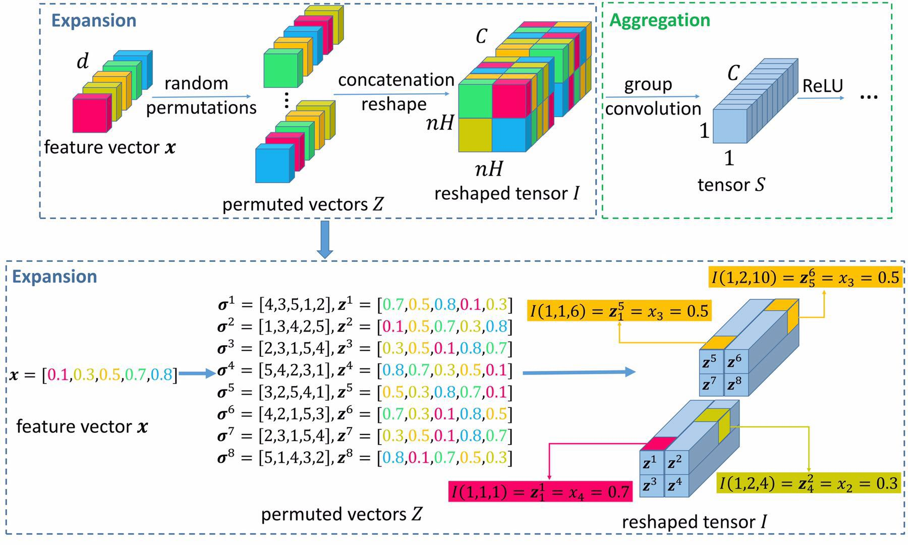

## Neural Random Subspace (NRS), 3D Part

This repo includes the content that we use to verify the effectiveness of NRS (Neural Random Subspace) module on 3D Point Cloud Recognition Task. 




It is based on the following implementations:

- https://github.com/WangYueFt/dgcnn
- https://github.com/yanx27/Pointnet_Pointnet2_pytorch

**Major implementations of NRS can be found here: https://github.com/CupidJay/NRS_pytorch**


For the details of ideas and results, please refer to our paper. We'd love you to cite it if you find it helpful :)

```bib
@article{NRS,
	title        = {Neural random subspace},
	author       = {Yun-Hao Cao and Jianxin Wu and Hanchen Wang and Joan Lasenby},
	year         = 2021,
	journal      = {Pattern Recognition},
	volume       = 112,
	pages        = 107801,
	doi          = {https://doi.org/10.1016/j.patcog.2020.107801},
	issn         = {0031-3203}
}
```


#### To start with:

##### - Data Preparation:

```bash
bash archive_bash/download_data.sh
```

##### - Training Models:

```bash
bash archive_bash/train_pointnet.sh
bash archive_bash/train_pointnet2.sh
bash archive_bash/train_dgcnn.sh
```

##### - FLOPS and \#Params

```bash
see utils/FLOPs_Calculator.py for details
```

##### - Inference Time

```bash
bash archive_bash/timer.sh
```
